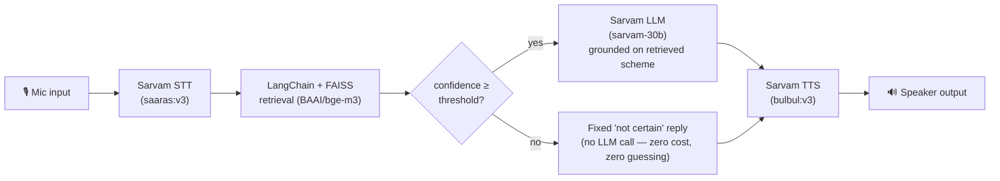

# Scheme Sahayak

**A voice-based government scheme eligibility assistant for Hindi and Malayalam speakers.**

Speak a question, get a spoken answer — grounded in real central government scheme data,
with an honest "I'm not certain" instead of a confident guess whenever the system doesn't
actually know.


---

## What this actually is (and isn't)

Voice-based, multilingual government scheme discovery isn't a new idea — [myScheme](https://www.myscheme.gov.in)
already runs its own voice-enabled AI chatbot, and India's [BHASHINI](https://bhashini.gov.in)
initiative launched **VoicERA**, a national open-source voice AI stack, explicitly targeting
this exact use case (Feb 2026). [Jugalbandi](https://github.com/OpenNyAI) and other
AI4Bharat-backed projects have covered similar ground over WhatsApp.

This project isn't trying to compete with any of that. It's a **from-scratch personal build**
of the same real problem, on a deliberately locked-down stack (Pipecat, Sarvam AI, LangChain +
FAISS — no swapping in a different framework if things get hard), done to actually learn and
demonstrate the engineering: building a full voice pipeline, wiring a RAG system into it,
getting retrieval confidence calibration right, and debugging the genuinely nasty real-time
audio bugs that show up only once you actually run it out loud. See
[Engineering challenges](#engineering-challenges-solved) below for the specifics.

## Architecture



Every box above is a real Pipecat frame processor wired into one pipeline
([`app/main.py`](app/main.py)): `SarvamSTTService → EchoSuppressedTranscriptFilter →
LLMContextAggregatorPair → RAGLLMService → SarvamTTSService`, running on Pipecat's
`PipelineWorker`/`WorkerRunner`. `RAGLLMService` ([`app/rag_llm_service.py`](app/rag_llm_service.py))
is a thin custom bridge into [`app/rag.py`](app/rag.py) — the framework-agnostic retrieval +
threshold + generation logic, reusable outside the voice pipeline (see `scripts/test_rag.py`).

## Tech stack

| Layer | Tool | Why |
|---|---|---|
| Voice pipeline | [Pipecat](https://github.com/pipecat-ai/pipecat) (`PipelineWorker`/`WorkerRunner`) | Turn detection, VAD, frame orchestration — no custom audio/transport code |
| STT | Sarvam `saaras:v3` | Hindi + Malayalam speech recognition |
| TTS | Sarvam `bulbul:v3` | Hindi + Malayalam speech synthesis |
| Translation | Sarvam `mayura:v1` | Fills gaps where the scraped source data wasn't genuinely translated |
| LLM | Sarvam `sarvam-30b` | Grounded answer generation only — never called below the confidence threshold |
| Retrieval | LangChain + FAISS | Per-language similarity search over the scheme dataset |
| Embeddings | `BAAI/bge-m3` (local) | Free, on-device, strong Hindi/Malayalam performance — Sarvam has no embeddings API |
| Turn detection | Silero VAD + Pipecat smart-turn | Built-in, tuned via `VADParams`, no custom turn-detection logic |

## Demo — real transcripts, not cherry-picked

Both pulled from actual test runs (see [`PROGRESS.md`](PROGRESS.md) for the full log).

**Grounded answer (Malayalam)** — real scheme match, confidence 0.50:
> **Q:** അഗ്നിപഥ് പദ്ധതി എന്താണ്? *("What is the Agnipath scheme?")*
> **A:** അഗ്നിപഥ് പദ്ധതി എന്നത് ഇന്ത്യൻ സായുധ സേനയിലെ റിക്രൂട്ട്‌മെന്റിനായുള്ള ഒരു പദ്ധതിയാണ്. ഇത് മൂന്ന്
> സേവനങ്ങളിലും ബാധകമായ ആകർഷകമായ ഒരു വ്യക്തിഗത പ്രതിമാസ പാക്കേജ് നൽകുന്നു...
> *("Agnipath is a scheme for recruitment into the Indian armed forces. It offers an attractive
> personalized monthly package applicable across all three services...")*

**Honest "not certain" (Malayalam)** — no real widow-pension scheme in the dataset, confidence
0.34, **correctly refuses to fabricate one**:
> **Q:** വിധവ പെൻഷൻ പദ്ധതി എന്താണ്? *("What is the widow pension scheme?")*
> **A:** ക്ഷമിക്കണം, ഇതിനെക്കുറിച്ച് കൃത്യമായ വിവരങ്ങൾ കണ്ടെത്താൻ എനിക്ക് കഴിഞ്ഞില്ല. ദയവായി
> myscheme.gov.in നേരിട്ട് പരിശോധിക്കുക...
> *("Sorry, I couldn't find accurate information about this. Please check myscheme.gov.in
> directly...")*

**Grounded answer (Hindi)**: query "scholarship for me?" → matched the SC/ST postgraduate
professional-course scholarship scheme at confidence 0.475, correct detailed eligibility +
application-process answer.

## Engineering challenges solved

The interesting part of this project wasn't wiring the happy path — it was what broke once
real audio and real users were involved.

**Query buffer contamination across turns.** Multi-question voice testing showed only the
*first* question in a session got answered correctly — every question after it either
matched the wrong scheme or got an empty LLM response. Traced it (by reading Pipecat's
aggregator source directly, not guessing) to `LLMUserAggregator._handle_transcription`
appending every STT transcript to a pending buffer *unconditionally*, clearing it only when
a turn completes. The existing echo-suppression fix only blocked a new *turn* from starting
while the bot spoke — it never stopped the leaked audio's transcript from still being
buffered. So the next real question inherited the *entire previous answer's* echoed text,
concatenated in. Confirmed by querying the FAISS index directly with the isolated question
text (correct match) versus what the live pipeline actually retrieved (wrong match) — same
text, different result, proving contamination rather than a retrieval bug. Fixed with
[`app/echo_filter.py`](app/echo_filter.py)'s `EchoSuppressedTranscriptFilter`, a frame
processor that drops transcription frames outright while the bot is speaking, so leaked
audio never reaches the buffer in the first place.

**TTS feedback loop.** `LocalAudioTransport` has no acoustic echo cancellation, so on
speakers (and even on some headsets, Hindi specifically) the bot's own voice got picked up
by the mic, transcribed, and treated as a new user turn — a self-sustaining loop that ran
for 100+ seconds in one test before being killed manually. Root-caused via log evidence
(the "user's" transcribed words matched exactly what the bot was saying at that instant,
ruling out random STT hallucination), fixed with
[`app/turn_strategies.py`](app/turn_strategies.py)'s `EchoSafeVADStartStrategy`, a subclass
of Pipecat's own turn-start strategy that suppresses turn starts while the bot speaks plus a
short cooldown.

**Confidence threshold calibration.** Set from real retrieval score data rather than a
guessed number: genuine scheme matches scored 0.40–0.50, unrelated queries scored
0.27–0.37, so the threshold sits at 0.38 in that gap. Below it, the system returns a fixed,
Sarvam-Mayura-translated "not certain" message *without calling the LLM at all* — cheaper
and structurally incapable of guessing.

**Per-field hybrid translation.** Initial assumption was that myscheme.gov.in translates
scheme pages consistently site-wide once you switch language. Repeat testing (fresh browser
contexts, ruling out caching) showed this is false — section *headers* translate reliably,
but body content silently falls back to English on some schemes, inconsistently. Fixed with
a per-field hybrid: use native site content where it's genuinely in the target script
(checked via Unicode range detection), machine-translate the rest via Sarvam Mayura, with
translated fields explicitly flagged in the dataset.

**Defensive fallback on empty LLM responses.** Sarvam's completion API occasionally returns
empty/`None` content even for a well-grounded prompt. Rather than let that crash TTS frame
validation downstream, `app/rag.py` falls back to the same honest not-certain message —
consistent with the project's core rule (never push an uncertain or broken answer to the
user) rather than treating it as a special case.

## Setup

```bash
python -m venv .venv
.venv\Scripts\activate        # Windows; use `source .venv/bin/activate` on macOS/Linux
pip install -r requirements.txt
cp .env.example .env          # fill in SARVAM_API_KEY
```

Run the voice assistant:

```bash
python app/main.py --lang hi   # or --lang ml
```

Optional — regenerate the dataset/index from scratch instead of using the included
`data/schemes.json`:

```bash
playwright install chromium
python scripts/scrape_schemes.py
python scripts/build_index.py
```

Text-only testing without voice (retrieval or full RAG):

```bash
python scripts/test_retrieval.py --lang hi
python scripts/test_rag.py --lang hi
```

## Known limitations

- `LocalAudioTransport` (PyAudio) has no acoustic echo cancellation — a headset is required
  for clean turns; the mitigations above reduce but don't eliminate residual leak.
- Sarvam's LLM occasionally returns an empty completion for a well-grounded prompt — handled
  via fallback, not eliminated at the source (Sarvam-side behavior, outside this project).
- The 41-scheme dataset has real coverage gaps (agriculture-ministry schemes are
  under-represented due to an early scraping bug, since fixed for future scrapes but not
  backfilled).
- Runs locally only — no hosted/deployed version. (Central government schemes only, per the
  original project scope — no state-level schemes.)

## Build log

[`PROGRESS.md`](PROGRESS.md) has the full, unedited phase-by-phase build log — every bug
found, every real test result, in the order it actually happened.

## License

[MIT](LICENSE)
